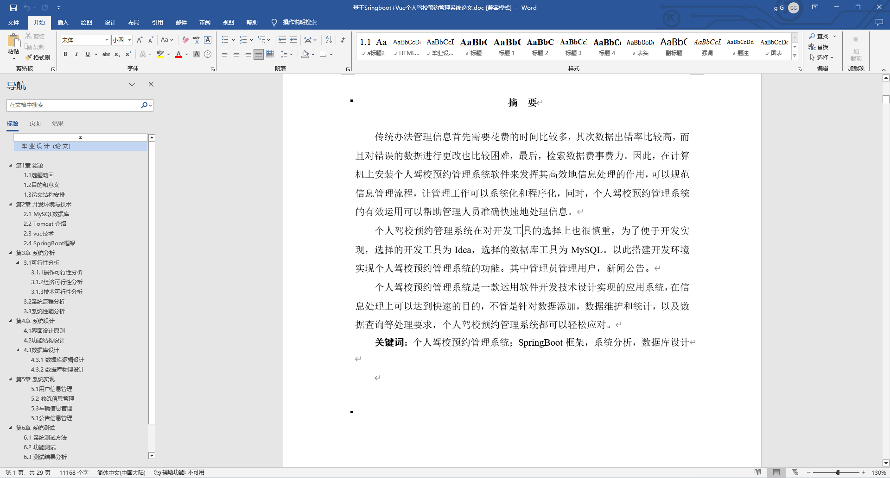
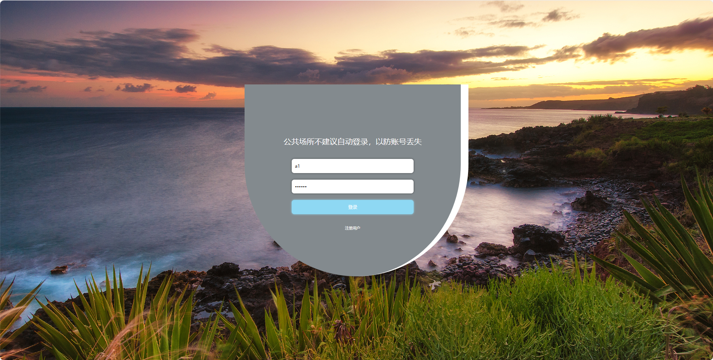
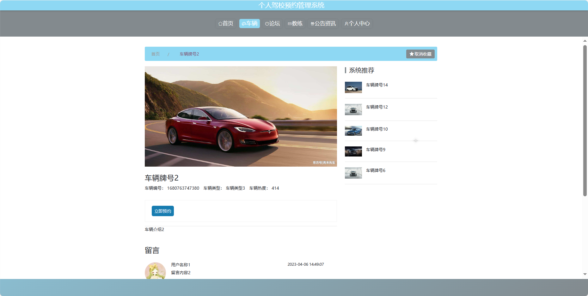
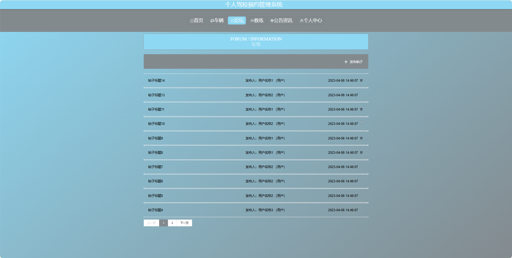
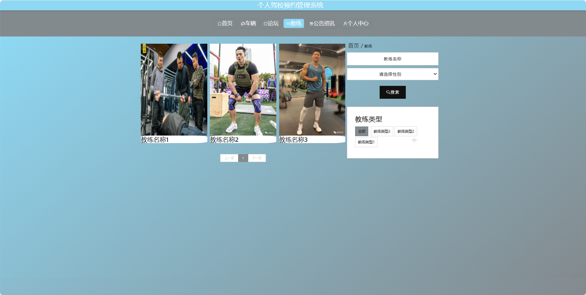
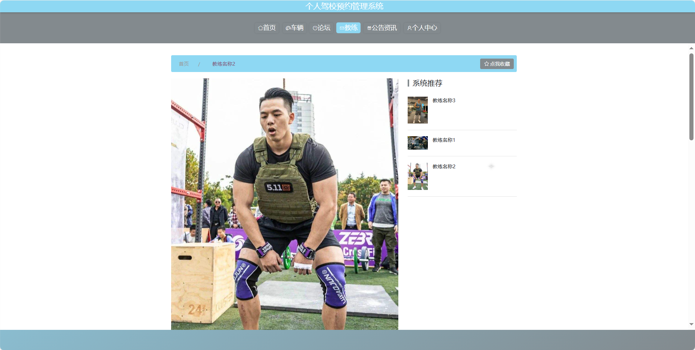
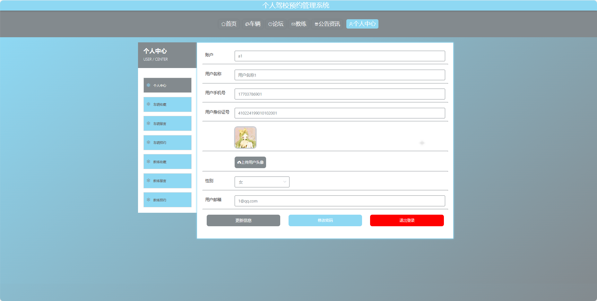
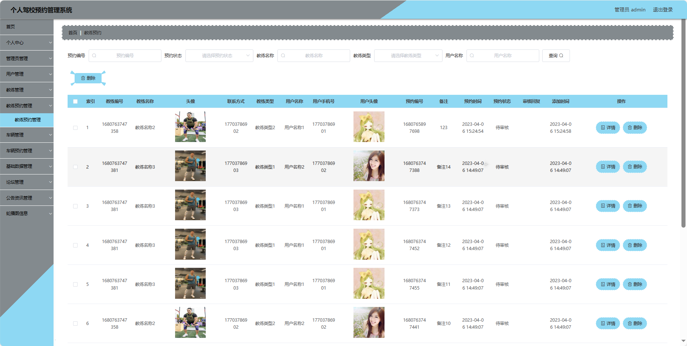
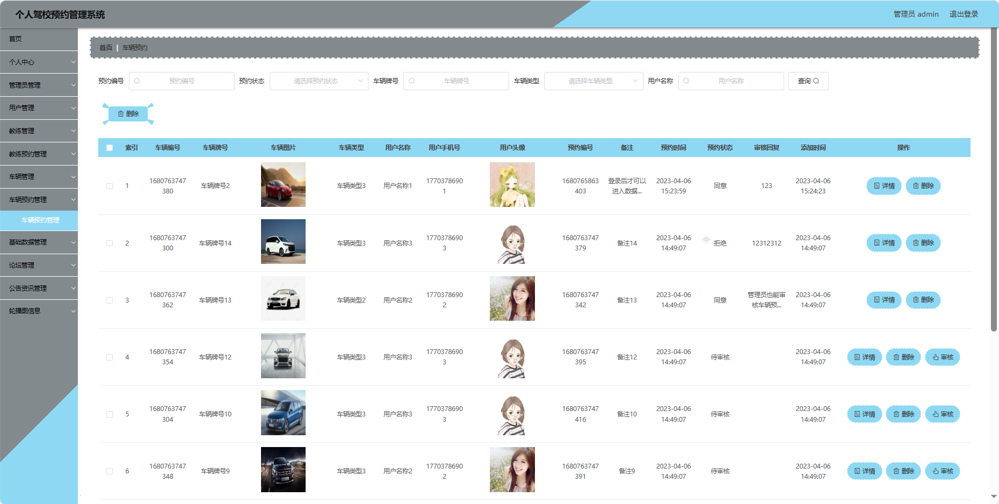

## 基于SpringBoot的个人驾校预约管理系统(程序+报告)

###  获取sql数据库文件: 从戎源码网 (https://armycodes.com/) QQ: 386869957 QQ群: 377586148
###  所有系统地址: (https://github.com/YuLin-Coder/AllProjectCatalog) 
###  所有项目以及源代码本人均调试运行无问题 可支持远程安装部署调试、定制修改、代码讲解

## 项目介绍
基于SpringBoot的个人驾校预约管理系统，系统包含三种角色：管理员、用户、教练，主要功能如下。

【用户功能】
1. 首页：获取系统信息。
2. 车辆：查看可预约的车辆信息。
3. 论坛：与其他用户分享驾驶心得和交流。
4. 教练：浏览教练的个人信息和可预约时间。
5. 公告资讯：了解最新的驾校资讯。
6. 个人中心：管理个人信息和查看预约记录。

【管理员功能】
1. 首页：查看系统整体。
2. 个人中心：管理管理员的个人信息。
3. 管理员管理：维护系统管理员的账户信息。
4. 用户管理：查看和管理系统用户的信息。
5. 教练管理：添加、编辑和删除教练信息。
6. 教练预约管理：审核和管理用户对教练的预约服务。
7. 车辆管理：管理驾校的车辆信息。
8. 车辆预约管理：审核和管理用户对车辆的预约服务。
9. 基础数据管理：管理系统的基础数据，如车辆类型等。
10. 论坛管理：审核和回复用户在论坛上的帖子。
11. 公告资讯管理：发布、编辑和管理驾校的公告资讯。
12. 轮播图信息：管理系统首页的轮播图展示。

【教练功能】
1. 首页：查看教练个人信息
2. 个人中心：管理教练的个人信息。
3. 教练管理：编辑可预约时间和车型信息。
4. 教练预约管理：查看和管理用户对教练的预约服务。
5. 车辆管理：查看可使用的车辆信息。
6. 车辆预约管理：查看和管理用户对车辆的预约服务。
7. 论坛管理：回复用户在论坛上的帖子。
8. 公告资讯管理：发布、编辑和管理驾校的公告资讯。

## 项目技术
- 编程语言：Java
- 数据库：MySQL
- 项目管理工具：Maven
- 前端技术：HTML、CSS、JavaScript、Jquery、Vue
- 后端技术：Spring、SpringMVC、MyBatis

## 运行环境
- JDK版本：JDK1.8及以上
- 开发工具：IDEA、Ecplise、Myecplise都可以
- 数据库: MySQL5.7及以上
- Maven：maven3.0及以上
- Node：14.14.0及以上

## 运行截图

